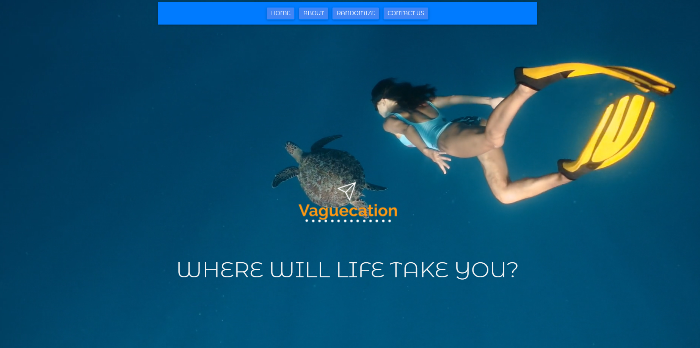
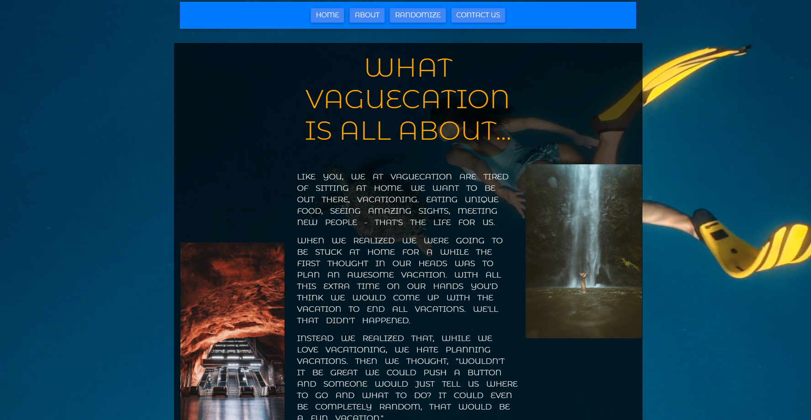
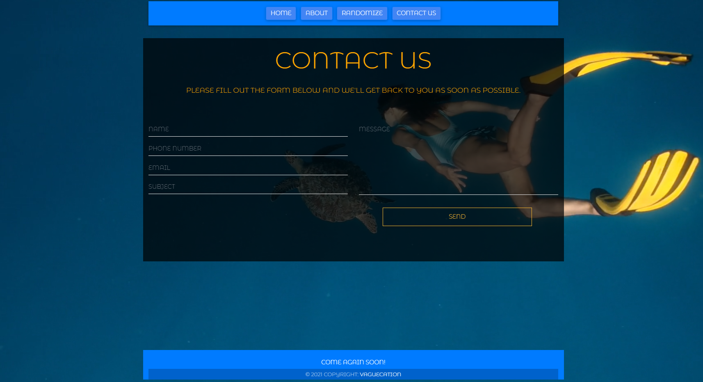

# Project: Vaguecation

Deployed Site Link - > https://vaguecation.herokuapp.com/

Utilized emailjs-com, unsplash-js, and reCaptua as a new technologies.

## Table of Contents:

- [Project: Vaguecation](#project-vaguecation)
  - [Table of Contents:](#table-of-contents)
  - [License:](#license)
  - [Description:](#description)
  - [Installation Instructions:](#installation-instructions)
  - [Usage Instructions:](#usage-instructions)
  - [Github:](#github)
  - [Contact Us:](#contact-us)
  - [Other Contributors:](#other-contributors)
  - [Images:](#images)

## License:

## Description:

Problem: 

Covid has people couped up and ready for a vacation. For many people the planning process is the least enjoyable part of a vacation, so why not skip it??? Vaguecation will provide the user with a random location to visit without a lot of hoops to jump through.

With more development Vaguecation will be able to email users a randomly generated email package, complete with hotel, restaurant, and activity suggestions for each day the user is looking to get away.

## Installation Instructions:

To install, type `npm install` into the terminal. This will install all the required node packages to run the server. Start the application by typing `npm start` into the terminal. 

## Usage Instructions: 
To be emailed a Vaguecation location enter your email address and click any of the image buttons.

## Github:

Check out more projects on my Github at https://github.com/ReindeerCode

## Contact Us:

If you have any questions please feel free to email me at ReindeerCode@gmail.com

## Other Contributors:

None at this time

## Images:

Following screen shot is of the landing page 

Following screen shot is of the about Us page

Following screen shot is of the create Vaguecation page

Following screen shot is of the contact us page

